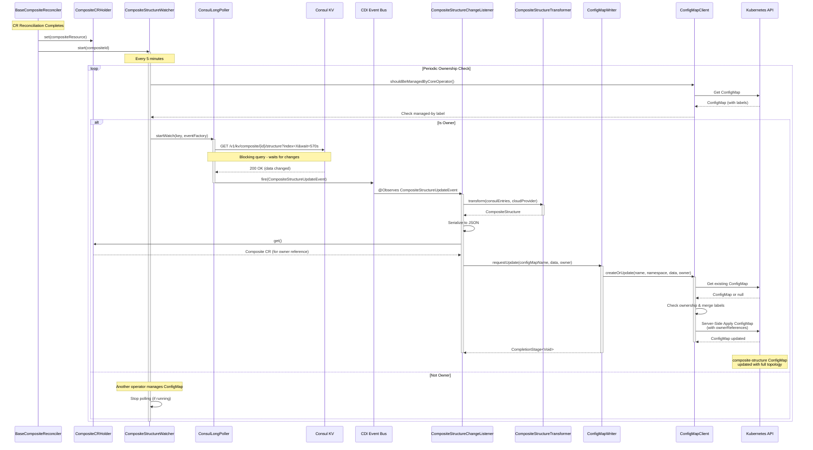
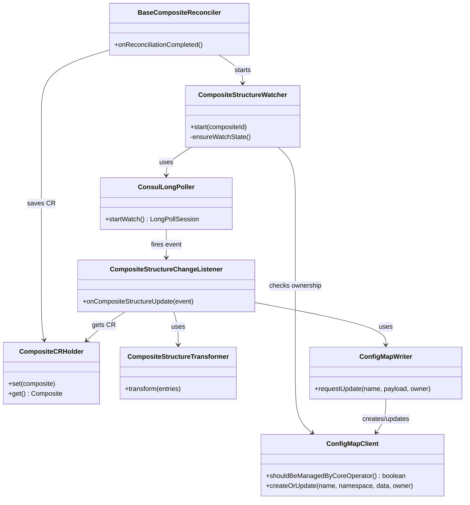

# Composite Structure Synchronization

## Overview

Automatic synchronization of **Composite Structure** topology from Consul KV store to Kubernetes ConfigMaps. After successful reconciliation of a Composite CR, the mechanism watches Consul for structure changes and maintains a `composite-structure` ConfigMap with the current topology (baseline and satellite namespaces with blue-green deployment roles).

---

## How It Works

### Background: Distributed Composite Structure

A **composite structure** consists of multiple Kubernetes namespaces working together as a logical application unit. Each namespace:
- Has its own **core-operator** instance running
- Contains its own **Composite custom resource** (CR)
- Represents a piece of the overall composite topology

When a Composite CR is reconciled, **each operator writes its namespace's portion** of the composite structure to Consul KV.

This creates a **distributed configuration** where the complete composite structure is assembled from contributions of multiple operators across different namespaces.

### What This Mechanism Adds

This synchronization mechanism solves a key challenge: **making the complete composite structure easily accessible within Kubernetes**.

When any part of the composite structure changes in Consul, **every core-operator in every namespace**:

1. **Watches Consul for changes** - Continuously monitors the complete composite structure in Consul
2. **Aggregates the full topology** - Collects all namespace contributions into a unified view
3. **Publishes to local ConfigMap** - Writes the complete structure to a `composite-structure` ConfigMap in its namespace

**Result**: Every namespace gets a **local, up-to-date ConfigMap** containing the full composite structure, enabling applications and controllers to discover the topology without direct Consul access.

**Key Principle**: Consul remains the source of truth (written by all operators), while ConfigMaps provide convenient Kubernetes-native access to the aggregated structure (read by applications).

---

## Configuration Parameters

### Application Properties

Set in `application.properties` or via system properties:

| Property                                        | Description | Default |
|-------------------------------------------------|-------------|---------|
| `cloud.composite.structure.sync.enabled`        | Enable/disable synchronization feature | `true` |
| `cloud.composite.structure.sync.check-interval` | ConfigMap ownership check interval (ms) | `300000` (5 min) |
| `cloud.consul-long-poll.retry-time`             | Delay before retry on Consul error (ms) | `20000` (20 sec) |
| `cloud.consul-long-poll.on-success-delay-time`  | Delay between successful polls (ms) | `3000` (3 sec) |

### Deployment Parameters

Set as environment variables in deployment manifest:

| Variable | Description | Default |
|----------|-------------|---------|
| `CLOUD_PROVIDER` | Cloud provider identifier (included in output JSON) | `OnPrem` |

### Requirements

- Consul API endpoint accessible from operator pod
- Operator pod has permissions to create/update ConfigMaps in its namespace

---

## Input and Output

### Consul KV Structure (Input)

After Composite CRs reconciliation, the composite structure is automatically written to Consul KV at:

```
composite/{compositeId}/structure/{namespace}/{attribute}
```

**Attributes**:
- `compositeRole`: `baseline` or `satellite`
- `bluegreenRole`: `controller`, `origin`, or `peer`
- `controllerNamespace`: Reference to controller namespace (for origin/peer namespaces)

### Example

**In Consul KV**:
```
# Baseline with blue-green roles
composite/baseline-origin/structure/baseline-controller/compositeRole = baseline
composite/baseline-origin/structure/baseline-controller/bluegreenRole = controller

composite/baseline-origin/structure/baseline-origin/compositeRole = baseline
composite/baseline-origin/structure/baseline-origin/bluegreenRole = origin
composite/baseline-origin/structure/baseline-origin/controllerNamespace = baseline-controller

composite/baseline-origin/structure/baseline-peer/compositeRole = baseline
composite/baseline-origin/structure/baseline-peer/bluegreenRole = peer
composite/baseline-origin/structure/baseline-peer/controllerNamespace = baseline-controller

# Satellite with blue-green roles
composite/baseline-origin/structure/satellite-controller/compositeRole = satellite
composite/baseline-origin/structure/satellite-controller/bluegreenRole = controller

composite/baseline-origin/structure/satellite-origin/compositeRole = satellite
composite/baseline-origin/structure/satellite-origin/bluegreenRole = origin
composite/baseline-origin/structure/satellite-origin/controllerNamespace = satellite-controller

composite/baseline-origin/structure/satellite-peer/compositeRole = satellite
composite/baseline-origin/structure/satellite-peer/bluegreenRole = peer
composite/baseline-origin/structure/satellite-peer/controllerNamespace = satellite-controller
```

**In `composite-structure` ConfigMap**:
```yaml
apiVersion: v1
kind: ConfigMap
metadata:
  name: composite-structure
  namespace: operator-namespace
  labels:
    app.kubernetes.io/managed-by: core-operator
    app.kubernetes.io/part-of: Cloud-Core
  ownerReferences:
    - apiVersion: core.netcracker.com/v1
      kind: Composite
      name: composite
      uid: ed5df067-667e-4b35-ac5f-5eeda9b2046c
      controller: true
      blockOwnerDeletion: false
data:
  data: >-
    {
      "cloudProvider": "OnPrem",
      "composite": {
        "baseline": {
          "controller": "bs-controller",
          "origin": "bs-origin",
          "peer": "bs-peer"
        },
        "satellites": [
          {
            "controller": "sat-controller",
            "origin": "sat-origin",
            "peer": "sat-peer"
          }
        ]
      }
    }
```

where:
- `cloudProvider`: Cloud provider identifier from `CLOUD_PROVIDER` deployment variable
- `composite.baseline`: Single baseline namespace with optional blue-green roles (controller/origin/peer as strings)
- `composite.satellites`: Array of satellite namespaces, each with optional blue-green roles

---

## ConfigMap Ownership Management

### Purpose

The ownership check mechanism allows **dynamic handover of ConfigMap management** between different operators. This is essential for:
- **Controlled migration**: Ownership can be transferred to another operator by changing ConfigMap's `ownerReferences`
- **Automatic stop**: core-operator stops managing ConfigMap when ownership is lost

### How It Works

1. Every `checkInterval` (default 5 min), watcher calls `configMapClient.shouldBeManagedByCoreOperator()`
2. **ConfigMapClient** checks ConfigMap's `app.kubernetes.io/managed-by` label:
   - If label points to another operator returns `false`
   - Other vice return `true` (core-operator manages config map by default)
3. **If owner**: Starts/continues Consul polling
4. **If not owner**: Stops Consul polling immediately via `session.cancel()`
5. ConfigMap can be claimed by another operator by changing the `managed-by` label

---

## Detailed Design

### How It Works

1. **Composite CR reconciliation** completes → saves CR to `CompositeCRHolder` → starts `CompositeStructureWatcher`
2. `CompositeStructureWatcher` schedules periodic ownership checks (every 5 min by default)
3. **Ownership check**: `ConfigMapClient.shouldBeManagedByCoreOperator()` checks label → continue or stop
4. If owner, starts **ConsulLongPoller** to watch `composite/{id}/structure` path
5. **Consul long-polling**: Blocks until data changes or timeout
6. On change, fires CDI event **CompositeStructureUpdateEvent**
7. **CompositeStructureChangeListener** observes event:
   - Calls **CompositeStructureTransformer** to parse Composite Structure
   - Serializes to JSON
   - Gets Composite CR from **CompositeCRHolder** (for owner reference)
   - Calls **ConfigMapWriter** to persist (async with retry)
8. **ConfigMapWriter** calls **ConfigMapClient** to create/update ConfigMap with owner reference

### Key Features

- **Long-Polling**: Efficient change detection using Consul blocking queries (no constant polling overhead)
- **Ownership Management**: Prevents conflicts in multi-operator environments; allows controlled handover
- **Fault Tolerance**: Exponential backoff retry (3s → 30s max, up to 10 attempts) on K8s API failures
- **Event-Driven**: CDI events decouple components

### Component Flow



---

## Components

**Package**: `com.netcracker.core.declarative.service.composite`

### Main Classes

- **BaseCompositeReconciler**: Triggers watcher on CR reconciliation completion; saves CR to holder
- **CompositeCRHolder**: Thread-safe holder for current Composite CR; provides access to owner reference
- **CompositeStructureWatcher**: Orchestrator; manages ownership checks and polling lifecycle
- **ConfigMapClient**: Kubernetes ConfigMap manager; checks ownership via `managed-by` label; uses server-side apply
- **ConsulLongPoller**: Consul integration with long-polling pattern (blocking queries)
- **CompositeStructureChangeListener**: CDI event observer; orchestrates transformation and persistence
- **CompositeStructureTransformer**: Parses Consul KV entries to `CompositeStructureConfigMapPayload`
- **ConfigMapWriter**: Kubernetes persistence with async writes and retry logic (10 retries, exponential backoff)

### Key Supporting Components

- **ConfigMapClient**: Manages ConfigMap lifecycle with ownership awareness via `app.kubernetes.io/managed-by` label
- **CompositeCRHolder**: Thread-safe holder for Composite CR; provides access to CR for setting owner references on ConfigMap

### Model

- **CompositeStructure**: Domain model records (`NamespaceRoles` with controller/origin/peer)
- **CompositeStructureUpdateEvent**: CDI event containing Consul KV entries
- **LongPollSession**: Handle for cancellable polling session

---

## Class Diagram



---